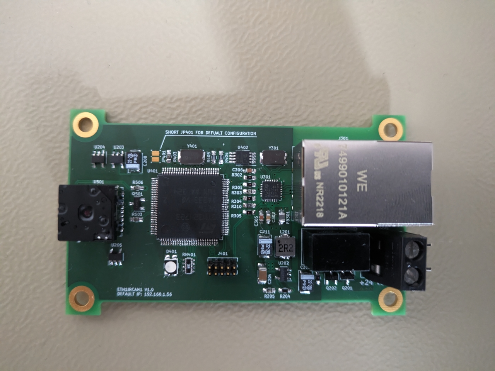
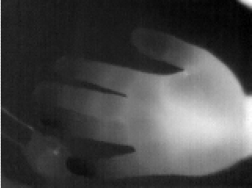
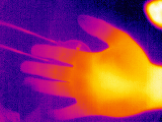

# ETH1IRCAM1
> Ethernet interface for the Flir Lepton 3.5 and 3.1 thermal camera modules. Project inspired by Dan Julio tCam (https://github.com/danjulio/tCam).

## Images

 ETH1IRCAM1 V1.0 

  
 

 

 Example of radiometric image (left) and RGB (right) - zoom 2x. 

  
   
 

 
 ## Resources
- SCPI parser - https://github.com/j123b567/scpi-parser
- KiCAD - https://www.kicad.org
- STM32CubeIDE - https://www.st.com/en/development-tools/stm32cubeide.html
- tCam - https://github.com/danjulio/tCam
- FreeRTOS - https://www.freertos.org/
- leptonic - https://github.com/themainframe/leptonic
