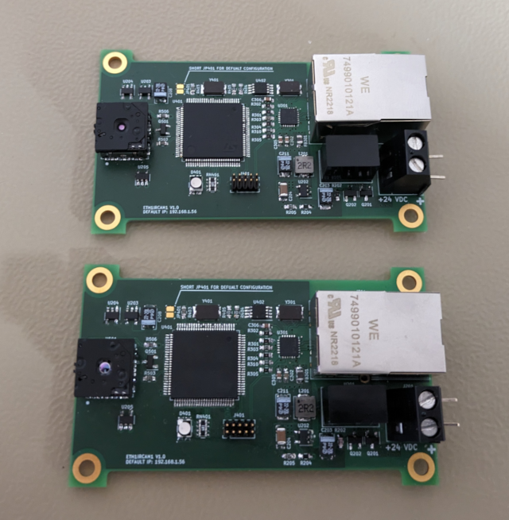
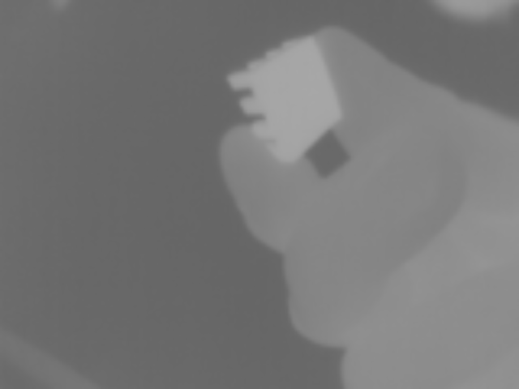
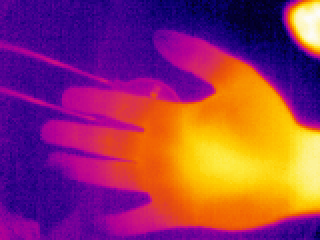
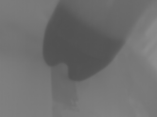

# ETH1IRCAM1
> Ethernet interface for the Flir Lepton 3.5 and 3.1R thermal camera modules. Project inspired by Dan Julio tCam (https://github.com/danjulio/tCam).

## Parameters

### Supply
- Voltage :
  - MIN : 15 VDC
  - DEF : **24 VDC**
  - MAX : 36 VDC 
- Power :
  - 1.5 W normal run.
  - 2.9 W during shutter operation.
### Ethernet :
  - 10/100 Base-T
  - **TCP/IP** (default port 2000) - To control the ETH1IRCAM1 using SCPI commands.
  - **UDP** (default port 16384) - Outputs the video data as RTP (with two additional headers) packages.

## Images

  Two ETH1IRCAM1 V1.0 prototype boards, with mounted Flir Lepton 3.1R (top) and 3.5 (bottom). 

 

 Example of RAW14 and RGB888 images from Lepton 3.1R - zoom 2x. 

  
   

 
 
 Example of RAW14 image from Lepton 3.5 - zoom 2x. 

  

 ## Resources
- Flir Lepton - https://www.flir.com/developer/lepton-integration/
- SCPI parser - https://github.com/j123b567/scpi-parser
- KiCAD - https://www.kicad.org
- STM32CubeIDE - https://www.st.com/en/development-tools/stm32cubeide.html
- tCam - https://github.com/danjulio/tCam
- FreeRTOS - https://www.freertos.org/
- leptonic - https://github.com/themainframe/leptonic

## TBD
1. Need to create documentation for SCPI commands.
2. Need to check all implemented SCPI commands.
3. Create software for device control, now there are two simple python scripts in the EXAMPLES folder.
4. (Optional) Design a housing to protect the Lepton from mechanical damage and dust. PCB redesign will be required. 

